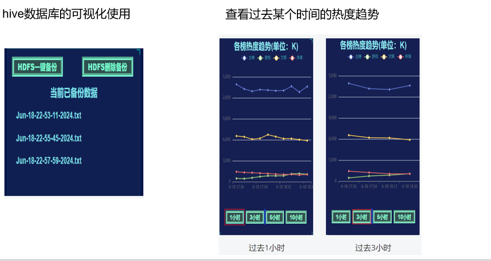
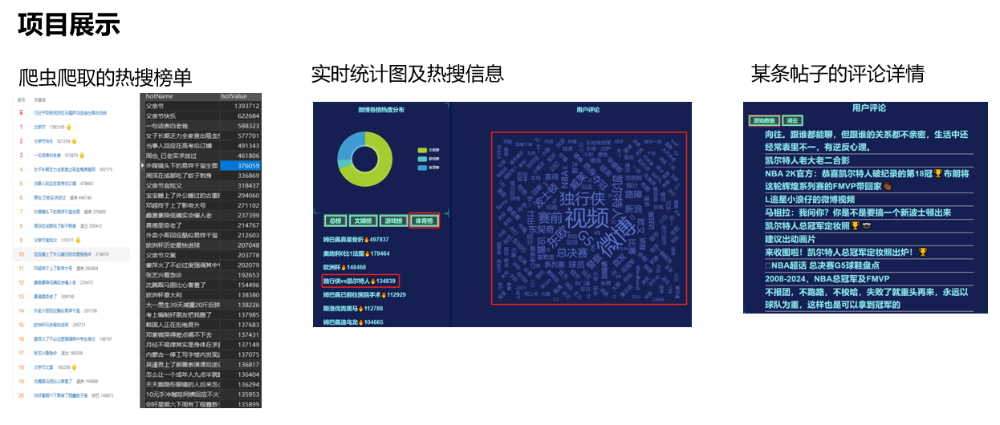

# 微博爬虫项目

## 项目简介

这是一个微博爬虫项目，用于爬取微博热搜数据、帖子内容，并进行数据可视化展示。项目使用Python开发，包含爬虫模块、数据存储模块和Web展示模块。

## 功能特性

- 爬取微博热搜总榜、文娱榜、体育榜、游戏榜数据
- 爬取热搜相关的帖子内容
- 数据存储到MySQL数据库
- 提供Web界面展示数据，包括热度趋势图、词云等
- 支持实时更新数据

## 目录结构

```
weibo-spider/
├── src/               # 源代码目录
│   ├── main.py        # 主程序，启动Web服务器和爬虫
│   ├── spider.py      # 爬虫模块，负责爬取数据
│   ├── MySqlCtrl.py   # 数据库操作模块
│   ├── getdata.py     # 数据处理模块
│   └── STOPWORD.txt   # 停用词列表
├── static/            # 静态资源目录
│   ├── china.js       # 中国地图数据
│   ├── echarts-words.js # 词云插件
│   ├── echarts.min.js # ECharts图表库
│   ├── flexible.js    # 响应式布局
│   ├── index.css      # 样式文件
│   ├── index.js       # 前端逻辑
│   ├── jquery.countup.min.js # 数字计数插件
│   ├── jquery.js      # jQuery库
│   ├── jquery.waypoints.min.js # 滚动触发插件
│   └── myMap.js       # 地图相关
├── data/              # 数据目录
├── docs/              # 文档目录
├── index.html         # 主页面
├── requirements.txt   # 依赖包列表
└── README.md          # 项目说明
```

## 环境要求

- Python 3.7+
- MySQL 5.7+
- 依赖包：
  - requests
  - beautifulsoup4
  - web.py
  - pymysql
  - lxml

## 安装与配置

1. 克隆项目：
   ```bash
   git clone https://github.com/yourusername/weibo-spider.git
   cd weibo-spider
   ```

2. 安装依赖：
   ```bash
   pip install -r requirements.txt
   ```

3. 配置数据库：
   - 创建MySQL数据库（默认数据库名为`cauc`）
   - 修改`main.py`中的数据库连接信息：
     ```python
     mysqldataCtrl=MySqlCtrl.database("localhost","root","yourpassword","cauc")
     ```

4. 配置微博Cookie：
   - 登录微博网页版，获取Cookie
   - 修改`main.py`中的Cookie值：
     ```python
     cookie="your_weibo_cookie"
     ```

## 运行项目

1. 启动爬虫和Web服务器：
   ```bash
   python src/main.py
   ```

2. 访问Web界面：
   - 打开浏览器，访问 `http://localhost:8080`

## 数据结构

### 数据库表结构

- `weibo_realtimehot`：热搜总榜数据
- `weibo_entrank`：文娱榜数据
- `weibo_sport`：体育榜数据
- `weibo_game`：游戏榜数据
- `weibo_realtimehot_history`：热搜总榜历史数据
- `weibo_entrank_history`：文娱榜历史数据
- `weibo_sport_history`：体育榜历史数据
- `weibo_game_history`：游戏榜历史数据
- 每个热搜词条对应的帖子表（动态创建）

## 爬取策略

- 每2分钟更新一次热搜数据和帖子内容
- 每6分钟记录一次历史热度数据
- 使用多线程同时执行爬取和历史记录任务

## 注意事项

- 请遵守微博的爬虫规则，不要过度请求
- 定期更新Cookie，避免被微博封禁
- 数据库表会自动创建，无需手动创建
- 首次运行时，需要等待一段时间才能看到数据

## 项目截图

### 数据存储架构


### 项目界面展示


## 许可证

本项目采用MIT许可证。
